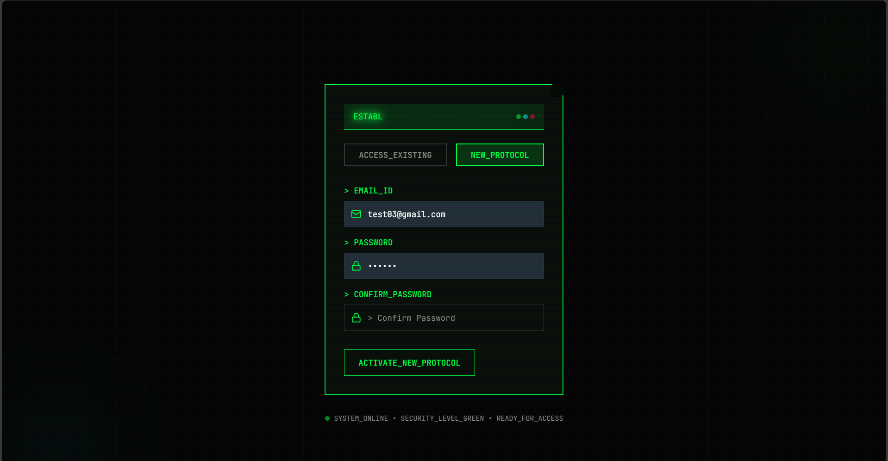
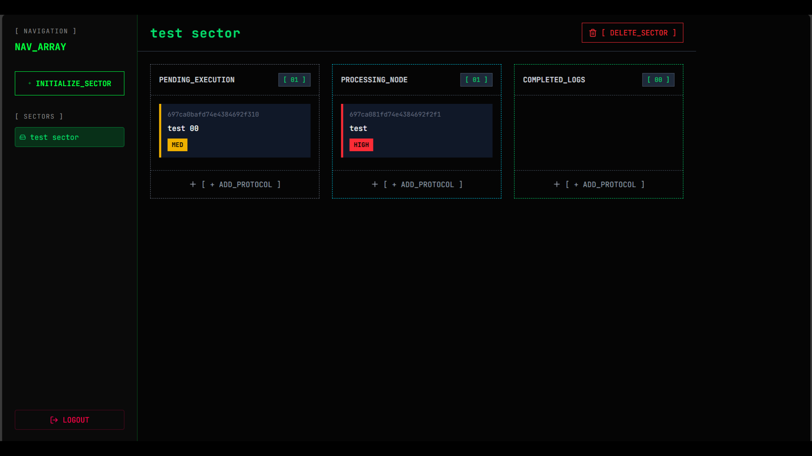
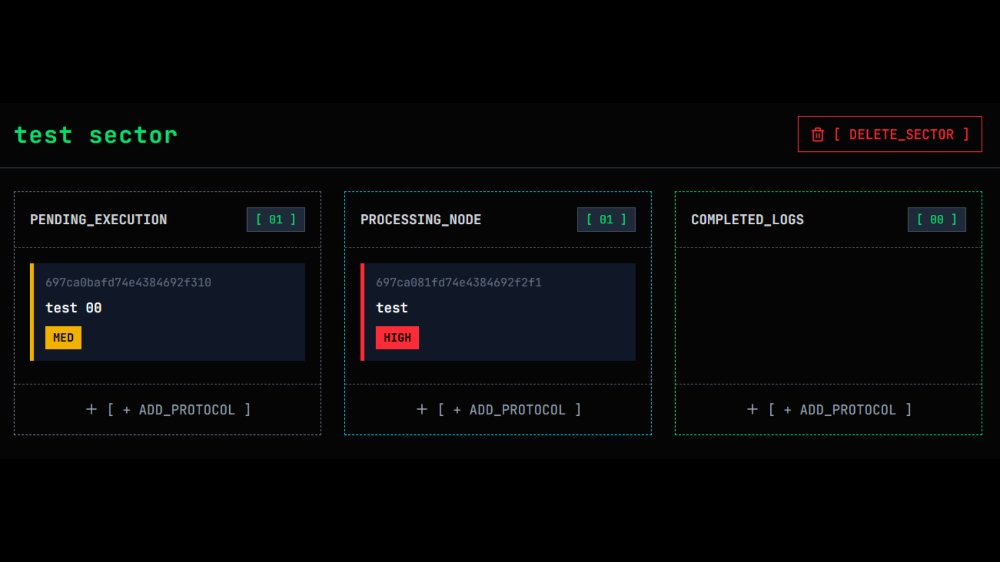
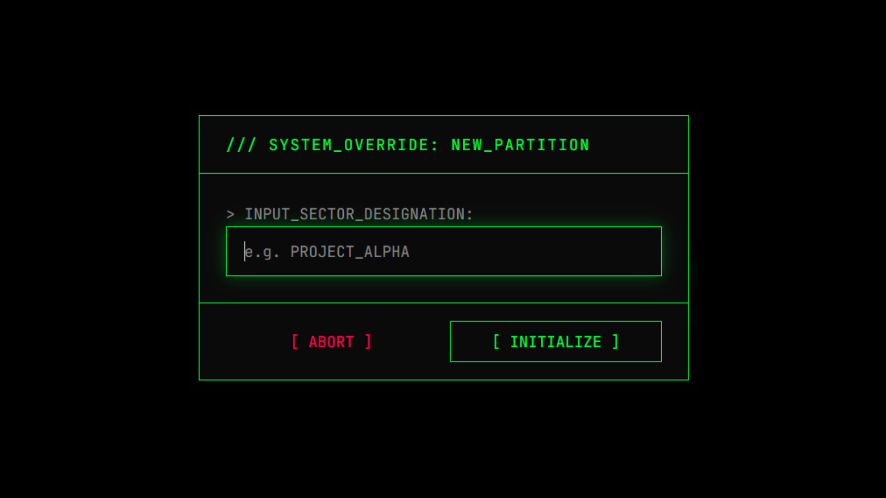
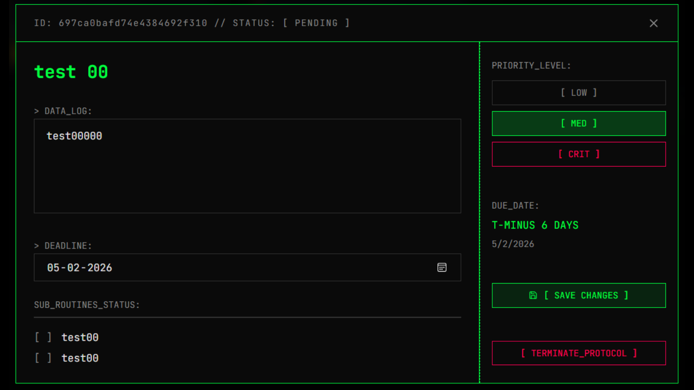
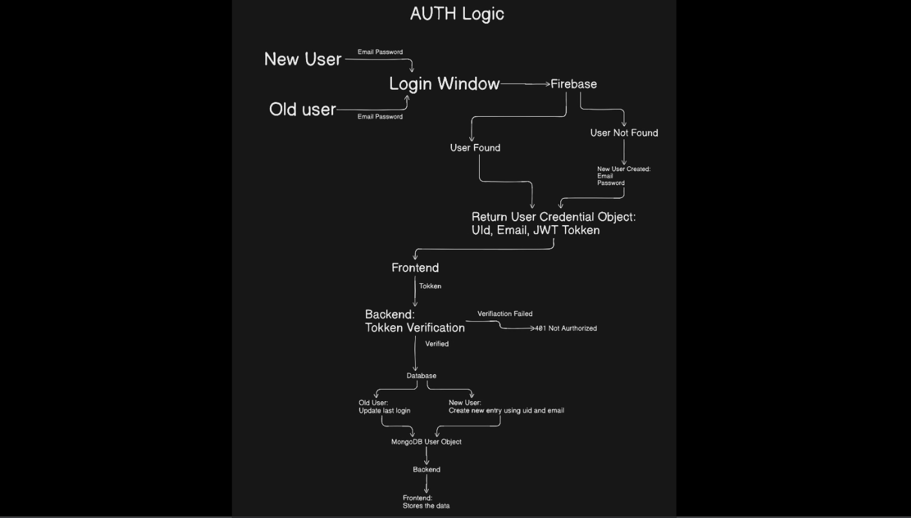

# Cyberpunk Kanban Board

<div align="center">

[](https://opensource.org/licenses/MIT)
[](https://nextjs.org/)
[](https://www.typescriptlang.org/)
[](https://firebase.google.com/)
[](https://www.mongodb.com/)
[](https://nodejs.org/)

</div>

<p align="center">
  
</p>

<h3 align="center">A futuristic task management application with a cyberpunk aesthetic</h3>

<p align="center">
  <strong>Transform your productivity with a sleek, futuristic Kanban board featuring drag-and-drop functionality, real-time collaboration, and immersive cyberpunk design.</strong>
</p>

## 🖼️ Screenshots

<div align="center">










</div>

##  Features

- **🔐 Secure Authentication**: Firebase-powered authentication system with JWT tokens
- **📋 Kanban Board**: Intuitive drag-and-drop task management with customizable columns
- **⚡ Real-time Updates**: Instant synchronization across all connected clients
- **🎨 Cyberpunk UI**: Immersive neon-themed interface with dynamic animations
- **📱 Responsive Design**: Works seamlessly on desktop, tablet, and mobile devices
- **⚙️ Task Management**: Create, update, delete, and prioritize tasks with deadlines
- **🎯 Sub-tasks**: Break down complex tasks into manageable sub-routines
- **📊 Progress Tracking**: Visual progress indicators and completion metrics
- **🔒 Data Security**: Encrypted data transmission and secure API endpoints
- **🔄 Fractional Indexing**: Smooth drag-and-drop with precise task positioning

## 🛠️ Tech Stack

| Layer | Technology | Purpose |
|-------|------------|---------|
| **Frontend** | [Next.js 16](https://nextjs.org/) | React framework with server-side rendering |
| **UI Framework** | [Tailwind CSS](https://tailwindcss.com/) | Utility-first CSS framework |
| **UI Components** | [Radix UI](https://www.radix-ui.com/) | Accessible low-level UI components |
| **Icons** | [Lucide React](https://lucide.dev/) | Beautiful, consistent icon library |
| **State Management** | [React Context API](https://react.dev/learn/passing-data-deeply-with-context) | Global state management |
| **Animations** | [Framer Motion](https://www.framer.com/motion/) | Smooth, performant animations |
| **Drag & Drop** | [@hello-pangea/dnd](https://github.com/hello-pangea/dnd) | Beautiful drag-and-drop interactions |
| **Backend** | [Node.js](https://nodejs.org/) + [Express](https://expressjs.com/) | RESTful API server |
| **Database** | [MongoDB](https://www.mongodb.com/) + [Mongoose](https://mongoosejs.com/) | Document database with ODM |
| **Authentication** | [Firebase](https://firebase.google.com/) | Secure user authentication |
| **API Client** | [Axios](https://axios-http.com/) | Promise-based HTTP client |

## 📊 Architecture Overview

<div align="center">
  


</div>

## 🏗️ Project Structure

```
├── client/                    # Frontend application
│   ├── app/                   # Next.js 16 App Router
│   │   ├── globals.css        # Global styles
│   │   ├── layout.tsx         # Root layout
│   │   └── page.tsx           # Authentication page
│   ├── components/            # Reusable UI components
│   │   ├── AuthForm.tsx       # Authentication form
│   │   ├── KanbanBoard.tsx    # Main kanban board
│   │   ├── KanbanColumn.tsx   # Column component
│   │   ├── KanbanTaskCard.tsx # Task card component
│   │   ├── CreateTaskModal.tsx # Task creation modal
│   │   └── TaskDetailsModal.tsx # Task details modal
│   ├── hooks/                 # Custom React hooks
│   ├── lib/                   # Utility functions
│   ├── public/                # Static assets
│   └── src/                   # Additional client-side code
│       ├── config/            # Configuration files
│       ├── context/           # React context providers
│       ├── hooks/             # Custom hooks
│       └── services/          # API service functions
├── server/                    # Backend application
│   ├── app.js                 # Main server entry point
│   ├── src/
│   │   ├── config/            # Server configurations
│   │   ├── controllers/       # Request handlers
│   │   ├── middleware/        # Request processing middleware
│   │   ├── models/            # Database models
│   │   └── routes/            # API route definitions
└── README.md                  # Project documentation
```

## 🚀 Quick Start

### Prerequisites

- [Node.js](https://nodejs.org/) (v18 or higher)
- [pnpm](https://pnpm.io/) (recommended) or npm
- [MongoDB](https://www.mongodb.com/) instance
- [Firebase](https://firebase.google.com/) project

### Installation

1. **Clone the repository**
   ```bash
   git clone https://github.com/yourusername/cyberpunk-kanban-board.git
   cd cyberpunk-kanban-board
   ```

2. **Install dependencies**
   ```bash
   # Install client dependencies
   cd client
   npm install --legacy-peer-deps
   
   # Install server dependencies
   cd ../server
   npm install
   ```

3. **Configure environment variables**

   Create `.env` files in both client and server directories:

   **Server (.env)**:
   ```env
   # Database
   MONGODB_URI=mongodb://localhost:27017/cyberpunk-todo

   # Firebase
   FIREBASE_SERVICE_ACCOUNT=./serviceAccountKey.json

   # Server
   PORT=5000
   NODE_ENV=development

   # Client URL
   CLIENT_URL=http://localhost:3000
   ```

   **Client (.env.local)**:
   ```env
   NEXT_PUBLIC_API_URL=http://localhost:5000
   NEXT_PUBLIC_FIREBASE_API_KEY=your_firebase_api_key
   NEXT_PUBLIC_FIREBASE_AUTH_DOMAIN=your_firebase_auth_domain
   NEXT_PUBLIC_FIREBASE_PROJECT_ID=your_firebase_project_id
   NEXT_PUBLIC_FIREBASE_STORAGE_BUCKET=your_firebase_storage_bucket
   NEXT_PUBLIC_FIREBASE_MESSAGING_SENDER_ID=your_firebase_sender_id
   NEXT_PUBLIC_FIREBASE_APP_ID=your_firebase_app_id
   ```

4. **Start the applications**

   Terminal 1 (Server):
   ```bash
   cd server
   npm run dev
   ```

   Terminal 2 (Client):
   ```bash
   cd client
   npm run dev
   ```

5. **Access the application**
   - Frontend: [http://localhost:3000](http://localhost:3000)
   - Backend API: [http://localhost:5000](http://localhost:5000)

## 🔐 Authentication Flow

The application implements a secure authentication flow using Firebase:

1. **User Registration/Login**: Users authenticate via Firebase
2. **Token Exchange**: Frontend sends Firebase token to backend
3. **Verification**: Backend verifies token with Firebase Admin SDK
4. **User Sync**: Backend creates/updates user record in MongoDB
5. **Session Management**: JWT tokens are stored securely in browser

## 🎨 UI/UX Features

### Cyberpunk Design Elements
- Neon color scheme with green, cyan, and purple accents
- Glowing borders and shadows
- Futuristic typography and icons
- Animated transitions and micro-interactions
- Dark theme optimized for extended use

### Interactive Components
- **Drag & Drop**: Seamless task movement between columns
- **Task Cards**: Detailed cards with priority indicators
- **Modals**: Animated overlays for task creation/editing
- **Progress Bars**: Visual indicators for task completion
- **Responsive Layouts**: Adapts to different screen sizes

## 📈 Performance Benchmarks

| Metric | Performance |
|--------|-------------|
| **Initial Load Time** | < 2.5 seconds |
| **Page Rendering** | < 100ms (after hydration) |
| **API Response Time** | < 200ms average |
| **Bundle Size** | < 250KB (gzipped) |
| **Memory Usage** | < 100MB (idle state) |

## 🧪 Testing Strategy

### Frontend Testing
- Unit tests for React components
- Integration tests for API interactions
- End-to-end tests for critical user flows

### Backend Testing
- Unit tests for controllers and middleware
- Integration tests for database operations
- Security tests for authentication endpoints

## 🤝 Contributing

We welcome contributions to improve the Cyberpunk Kanban Board! Here's how you can help:

1. **Fork the repository**
2. **Create a feature branch** (`git checkout -b feature/amazing-feature`)
3. **Commit your changes** (`git commit -m 'Add amazing feature'`)
4. **Push to the branch** (`git push origin feature/amazing-feature`)
5. **Open a Pull Request**

Please read our [Contributing Guidelines](CONTRIBUTING.md) for more details.

## 📄 API Documentation

### Authentication Endpoints
```
POST /api/auth/sync      # Sync user with backend after Firebase login
```

### Board Endpoints
```
GET /api/boards/:id      # Get board details with tasks
DELETE /api/boards/:id   # Delete a board
```

### Task Endpoints
```
POST /api/todos          # Create a new task
PUT /api/todos/:id       # Update a task
DELETE /api/todos/:id    # Delete a task
PATCH /api/todos/:id/move # Move task between columns
```

### Request/Response Examples

**Create Task:**
```json
POST /api/todos
{
  "boardId": "board123",
  "title": "Implement authentication",
  "description": "Set up Firebase auth integration",
  "status": "PENDING",
  "priority": "CRIT",
  "position": 1000,
  "deadline": "2024-12-31",
  "subtasks": [
    { "title": "Setup Firebase", "isCompleted": true },
    { "title": "Create login form", "isCompleted": false }
  ]
}
```

**Response:**
```json
{
  "success": true,
  "task": {
    "_id": "task456",
    "title": "Implement authentication",
    "description": "Set up Firebase auth integration",
    "status": "PENDING",
    "priority": "CRIT",
    "position": 1000,
    "deadline": "2024-12-31",
    "subtasks": [
      { "_id": "sub1", "title": "Setup Firebase", "isCompleted": true },
      { "_id": "sub2", "title": "Create login form", "isCompleted": false }
    ],
    "createdAt": "2024-01-01T00:00:00.000Z",
    "updatedAt": "2024-01-01T00:00:00.000Z"
  }
}
```

## 🔒 Security Features

- **JWT Token Validation**: All API requests require valid tokens
- **Input Sanitization**: All user inputs are validated and sanitized
- **Rate Limiting**: Protection against API abuse
- **CORS Policy**: Restricted cross-origin requests
- **Secure Headers**: Additional security headers implemented
- **Password Encryption**: Secure password handling via Firebase

## 🚀 Deployment

### Frontend Deployment
1. Build the application: `pnpm build`
2. Deploy to Vercel, Netlify, or any static hosting platform

### Backend Deployment
1. Set production environment variables
2. Deploy to Heroku, DigitalOcean, or any Node.js hosting platform
3. Configure MongoDB Atlas for production database

## 📜 License

This project is licensed under the MIT License - see the [LICENSE](LICENSE) file for details.

## 🆘 Support

If you encounter any issues or have questions:

- Check the [FAQ](FAQ.md) for common questions
- Open an [issue](https://github.com/yourusername/cyberpunk-kanban-board/issues) on GitHub
- Join our [Discord community](https://discord.gg/example) for real-time support

## 🙏 Acknowledgments

- [Firebase](https://firebase.google.com/) for authentication services
- [MongoDB](https://www.mongodb.com/) for reliable database storage
- [Next.js](https://nextjs.org/) for the excellent React framework
- [Tailwind CSS](https://tailwindcss.com/) for rapid UI development
- All contributors who helped make this project possible

---

<div align="center">

**Made with ❤️ and futuristic dreams**

[⭐ Star this repo if you found it useful](https://github.com/yourusername/cyberpunk-kanban-board)

</div>